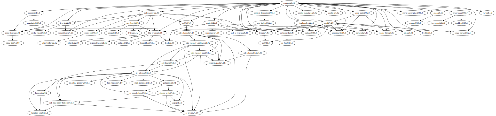

# Проект: Инструмент визуализации графа зависимостей для менеджера пакетов

## 1. Общее описание

Цель практической работы — разработать CLI-инструмент, который:
- анализирует зависимости пакета (в формате npm или тестового репозитория),
- строит полный граф зависимостей (включая транзитивные),
- отображает зависимости в виде ASCII-дерева и графа Graphviz DOT.

Проект реализует **все этапы практической работы (ПР)**:
1. Конфигурация через параметры командной строки.  
2. Получение данных о зависимостях из `package.json` (npm registry или GitHub).  
3. Построение графа зависимостей с помощью DFS (Depth-First Search).  
4. Вычисление порядка загрузки зависимостей (снизу-вверх).  
5. Визуализация в формате ASCII-дерева и Graphviz DOT.

Реализация выполнена на **Python 3.9+** без использования готовых менеджеров пакетов или библиотек анализа зависимостей.

---

## 2. Описание функций и настроек

### Основные файлы

| Файл | Назначение |
|------|-------------|
| `cli.py` | Точка входа CLI-приложения. Парсинг аргументов, маршрутизация режимов работы. |
| `fetch.py` | Загрузка `package.json` из npm registry или GitHub, обработка URL. |
| `parser.py` | Извлечение прямых зависимостей (`dependencies`) из JSON-файла. |
| `testrepo.py` | Работа с тестовыми графами зависимостей (DFS, визуализация, фильтрация, циклы). |
| `npmrepo.py` | (опционально) Рекурсивное построение графа npm-зависимостей из реестра. |
| `testdata/graph.txt` | Тестовый пример репозитория зависимостей. |

---

### Аргументы командной строки

| Параметр | Описание |
|-----------|-----------|
| `--package` | Имя анализируемого пакета (обязательно). |
| `--repo` | Путь к тестовому репозиторию (`.txt`) **или** URL/имя пакета npm. |
| `--test` | Включает тестовый режим (использует `testrepo.py`). |
| `--filter` | Подстрока для исключения пакетов при построении графа. |
| `--ascii-tree` | Вывод зависимостей в виде ASCII-дерева. |
| `--load-order` | Вывод порядка загрузки зависимостей (DFS post-order). |
| `--version` | Отображает версию утилиты. |

---

### Основные функции

| Функция | Модуль | Назначение |
|----------|--------|------------|
| `fetch_package_json(repo_or_url)` | `fetch.py` | Загружает `package.json` по URL/имени пакета. |
| `extract_dependencies(package_json)` | `parser.py` | Возвращает словарь прямых зависимостей `{имя: версия}`. |
| `load_test_repo(path)` | `testrepo.py` | Загружает тестовый граф из текстового файла. |
| `build_full_graph(root, repo, filter)` | `testrepo.py` | Рекурсивно строит граф зависимостей с учётом фильтра и циклов. |
| `get_load_order(graph, root)` | `testrepo.py` | Возвращает порядок загрузки «снизу-вверх». |
| `print_ascii_tree(graph, root, ...)` | `testrepo.py` | Печатает зависимости в виде ASCII-дерева. |
| `generate_dot(graph)` | `testrepo.py` | Формирует текстовое описание графа в формате Graphviz DOT. |
| `build_npm_graph(name, filter)` | `npmrepo.py` | (дополнительно) Строит граф npm-пакета через npm registry. |

---

## 3. Команды для сборки и запуска

### Установка зависимостей
```bash
pip install -r requirements.txt
```
## Пример визуализации зависимостей (Graphviz)


